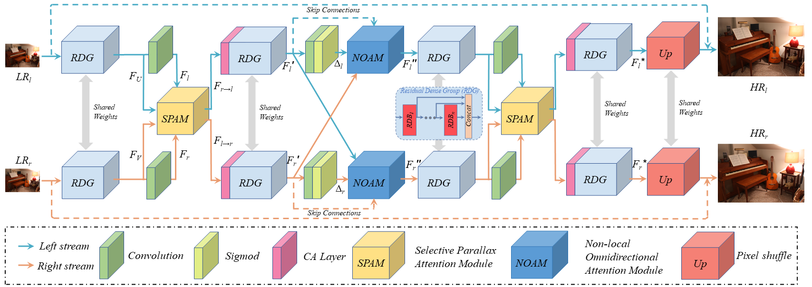

# ACLRNet
### PyTorch implementation of the paper [Stereo Image Restoration via Attention-Guided Correspondence Learning](https://ieeexplore.ieee.org/abstract/document/10412659/)

## Description

ACLRNet is a stereo image restoration framework, including stereo image denoising, super-resolution and compression artifact reduction.

<p align="center"> 

</p>

## Requirement:
* **Python 3.7.9, skimage 0.16.2, PyTorch 1.8.1, torchvision 0.9.1 and CUDA 10.2**
* **Matlab (For training data generation)**

### Train:
* **Download the training dataset Flickr1024_train from [Baidu Drive](https://pan.baidu.com/s/1Ov1bXigTA_F0OyXPDRPGHA ) (Key: zk3m) and unzip ititit to `./data/train`.** 
* **Run `./data/GenerateTrainingPatches.m` to generate training patches. The scales are set to 1, 2, 4 for different restoration tasks.**
* **Run `train.py` to perform training. Checkpoint will be saved to  `./log/`.**

### Test:
* **Download the testing datasets (KITTI2012, KITTI2015, Middlebury, ETH3D and Flickr1024_test) from [Baidu Drive](https://pan.baidu.com/s/1ZZGaDbpx03dGEzi97jY8IA) (Key: zm1p)  and unzip them to `./data/test`.**
* **Run `test.py` to perform inference. Results (`.png` files) will be saved to `./results`.**

## Citiation:
**If you find our work useful for your research, please consider citing this paper:**
```
@article{zhang2024stereo,
  title={Stereo Image Restoration Via Attention-Guided Correspondence Learning},
  author={Zhang, Shengping and Yu, Wei and Jiang, Feng and Nie, Liqiang and Yao, Hongxun and Huang, Qingming and Tao, Dacheng},
  journal={IEEE Transactions on Pattern Analysis and Machine Intelligence},
  year={2024},
  publisher={IEEE}
}
```

## Acknowledgement:
**Our code is inspired by [IPASSR](https://github.com/YingqianWang/iPASSR). We thank the authors for their great job!** 
**For questions, please send an email to [yuweics@outlook.com](yuweics@outlook.com).**
